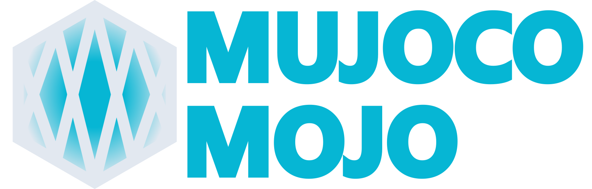

---
hide:
  - navigation
#   - toc
---
<style>
  .md-typeset h1,
  .md-content__button {
    display: none;
  }
</style>

<p align="center" class="mojo-splash">
  
</p>

<p align="center">
  <a href="https://pypi.org/project/mujoco-mojo/" class="badge-link">
    
  </a>
  <a href="https://pypi.org/project/mujoco-mojo/" class="badge-link">
    
  </a>
  <a href="https://github.com/Hydrowelder/mujoco-mojo/actions/workflows/release.yml" class="badge-link">
    
  </a>
  <a href="https://docs.pydantic.dev/latest/" class="badge-link">
    
  </a>
  <a href="https://opensource.org/licenses/Apache-2.0" class="badge-link">
    
  </a>
  <a href="https://hydrowelder.github.io/mujoco-mojo/" class="badge-link">
    
  </a>
  <a href="https://pypistats.org/packages/mujoco-mojo" class="badge-link">
    
  </a>
</p>

---

A **complete MJCF lifecycle and trial orchestration suite** for MuJoCo, powered by **Pydantic v2**.

**MuJoCo Mojo** bridges the gap between static XML modeling and large-scale simulation research. It provides a strongly-typed bridge for building models and a robust execution engine for running them at scale.

* **Model:** Build MJCFs via **validated Python objects** allowing for programatic generation.
* **Scale:** Execute **multi-threaded Monte Carlo trials** with built-in resume logic.
* **Monitor:** Track progress via a **zero-dependency web dashboard** and persistent logs.
* **Assess:** Quickly view **interactive results** of a trial in context of others.
* **Reproduce:** Automatic **environment snapshotting** (`requirements.txt`) for every job.

## Installation

Install `mujoco-mojo` in your project using the following:

=== "`uv` (recommended)"

    ```bash
    uv add mujoco-mojo
    ```

=== "`pip`"

    ```bash
    pip install mujoco-mojo
    ```

!!! warning
    At the time of writing, MuJoCo supports up to Python 3.13. This package is built on modern Python requiring 3.12 or above.


## Features

### MJCF Tools

* Strongly-typed MJCF elements backed by Pydantic v2
* Early validation of MJCF structure and attribute semantics
* Pythonic composition of assets, bodies, sensors, and plugins
* Designed to mirror MuJoCo’s XML schema closely (no magic abstractions)
* Suitable for code generation, tooling, and large model pipelines
* Embedded MuJoCo object enumerations to make getting `mjOBJ` IDs simple
* Specialized handling of dependency by remapping assets to become shared allows for space efficient execution of complex models

### Job Utilities

* Single or multi-threaded trial execution
* Random draw tools for Monte Carlo or rerun with global variable override
* Detailed status files for insight on trial progress
* Resume a previously started job without rerunning previous cases
* Automatically record installed Python packages to `requirements.txt` for job recreation (works with `uv` or `pip`)
* End of run summary with metric to help perform a state of health check
* Flexible command line utilities to run jobs

    ??? example
        ```bash
        mujoco-mojo run monte-carlo \
            --generator monte_carlo_test.Experiment.generate \
            --runtime monte_carlo_test.runtime \
            --workdir ./mc_test/ \
            --no-resume \
            --gen-arg 123 \
            --gen-kwarg 'test=1234' \
            --n-trial 10 \
            --n-proc 1
        ```

* Support for running jobs with SLURM for distributed compute
* Built in Rich logging for terminal and a rotating file handler for persistent logs

### Dojo Dashboard

A zero-dependency, offline-first web suite for monitoring and analyzing your simulation jobs in real-time.

#### Monitor: Real-Time Oversight

* Live Progress Tracking: Dynamic progress bars and color-coded status cards provide a high-level view of your Monte Carlo runs.
* Success/Failure Analytics: Automatic categorization of trials with built-in data integrity checks to identify "empty" vs. "failed" runs.
* Sensory Feedback: Optional audio cues and visual celebrations let you know exactly when a multi-hour job hits 100%.
* Deep-Linked Navigation: Jump straight from the monitor to any individual trial in the viewer with one click.

#### Mosaic: Advanced Telemetry Analysis

* High-Fidelity Plotting: Hardware-accelerated visualization using Plotly.js for seamless zooming and panning through millions of data points.
* Dynamic Versus Mode: Overlay current telemetry against previous trials using an intuitive range-selection slider for instant regression testing.
* Regex-Powered Filtering: Navigate high-dimensional datasets using a "folder-style" signal selector with suffix and regex support.
* State Persistence & Sharing: Every view is captured in a shareable, compressed URL by pasting a link to share your exact configuration.
* Pro-Grade Tooling: Built-in JSON configuration editor, drag-and-drop config restoration, and multi-format exports (SVG, PNG, CSV).
* Keyboard-First Design: Full hotkey support for warping between trials and managing views without leaving the home row.

### Reloaded

A rapid prototyping loop that allows you to modify physics logic and model architecture on the fly without ever closing the visualizer.

* **Module Hot-Reloading:** Recursively reloads local Python modules and MJCF logic, allowing code changes to propagate instantly to the active simulation.
* **Unified Visualizer Bridge:** Synchronized visualization of custom force and torque vectors across native OpenGL, Viser web interfaces, and video recordings.
* **Interactive Prototyping:** A developer-centric command loop to toggle playback speeds, repeat last commands, or trigger "generation-only" mode for rapid MJCF debugging.
* **Asset Persistence:** Automatically dumps current MJCF snapshots and model configurations to a workspace directory for post-hoc analysis or version tracking.

    ??? example
        ```bash
        mujoco-mojo reloaded \
            --generator monte_carlo_test.Experiment.generate \
            --runtime monte_carlo_test.runtime \
        ```
