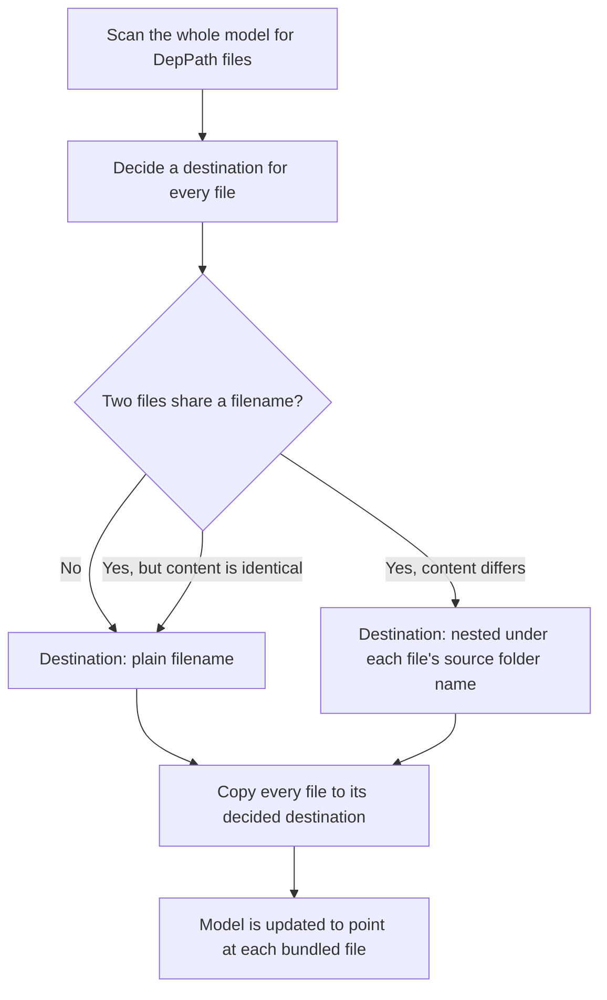

# Asset Bundling

!!! abstract
    This is an informational chapter. MuJoCo Mojo performs everything described here automatically whenever your model is generated, there is nothing you need to call or configure yourself. This page just explains what happens under the hood so you understand how your meshes, textures, and other dependency files end up in your bundled model.

---

## The Problem

Your model's `DepPath` fields (see [Assets and Materials](../workflow/generate-script.md#assets-and-materials)) can point at files scattered across your filesystem, a mesh here, a texture there, possibly reused across several of your projects. Before your model can be shared or run elsewhere, every one of those files needs to be collected into one shared assets folder next to your model's XML.

Doing that naively runs into two problems:

- **Wasted work**: if the same file has already been bundled in a previous run, copying it again every time is slow and unnecessary.
- **Silent corruption**: if two different files happen to share the same filename, such as `textures/wood/texture.png` and `textures/steel/texture.png`, copying both into the same flat folder means the second one copied overwrites the first. Whichever geom referenced the file that lost would now **silently point at the wrong texture**.

## How Mojo Solves It

Mojo never decides file-by-file as it goes. Instead it works in clear phases: it scans the *entire* model first, decides a destination for every dependency file up front (this is where any collisions get resolved), and only then starts copying. Deciding everything before touching disk is what lets it correctly spot a collision even when three or more files share a filename, not just two.



## Handling Filename Collisions

If two different source files share a filename but have different content, such as `textures/wood/texture.png` and `textures/steel/texture.png`, Mojo does not let one silently overwrite the other. Because every destination is decided before any copying starts, it can see the whole picture and nest the conflicting files under subfolders named after their original source directories, for example:

```
assets/
├── wood/
│   └── texture.png
└── steel/
    └── texture.png
```

Both files are kept, both are copied correctly, and your model's geoms are updated to point at the right one. You never need to rename your source files or reorganize your project to avoid this.

## Avoiding Duplicate Copies

Once every destination is decided, the copy phase checks each one against what is already sitting in the assets folder, first by file size, then by content hash. If it already matches, the copy is skipped entirely. This means re-generating a model you have already bundled before is fast and does not churn your assets folder with redundant writes.
