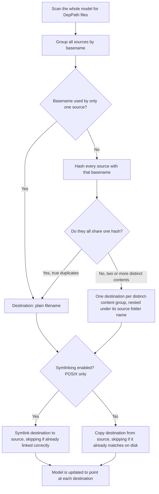

# Asset Bundling

!!! abstract
    This is an informational chapter. MuJoCo Mojo performs everything described here automatically whenever your model is generated; the only thing you can configure yourself is the [copy-versus-symlink choice](#symlinking-instead-of-copying) below. This page just explains what happens under the hood so you understand how your meshes, textures, and other dependency files end up in your bundled model.

---

## The Problem

Your model's `DepPath` fields (see [Assets and Materials](../workflow/generate-script.md#assets-and-materials)) can point at files scattered across your filesystem, a mesh here, a texture there, possibly reused across several of your projects. Before your model can be shared or run elsewhere, every one of those files needs to be collected into one shared assets folder next to your model's XML.

Doing that naively runs into two problems:

- **Wasted work**: if the same file has already been bundled in a previous run, copying it again every time is slow and unnecessary.
- **Silent corruption**: if two different files happen to share the same filename, such as `textures/wood/texture.png` and `textures/steel/texture.png`, copying both into the same flat folder means the second one copied overwrites the first. Whichever geom referenced the file that lost would now **silently point at the wrong texture**.

## How Mojo Solves It

Mojo never decides file-by-file as it goes. Instead it works in clear phases: it scans the *entire* model first, decides a destination for every dependency file up front (this is where any collisions get resolved), and only then starts copying. Deciding everything before touching disk is what lets it correctly spot a collision even when three or more files share a filename, not just two.



## Handling Filename Collisions

If two different source files share a filename but have different content, such as `textures/wood/texture.png` and `textures/steel/texture.png`, Mojo does not let one silently overwrite the other. Because every destination is decided before any copying starts, it can see the whole picture and nest the conflicting files under subfolders named after their original source directories, for example:

```text  linenums="0" title=""
assets/
├── wood/
│   └── texture.png
└── steel/
    └── texture.png
```

Both files are kept, both are copied correctly, and your model's geoms are updated to point at the right one. You never need to rename your source files or reorganize your project to avoid this.

## Avoiding Duplicate Copies

Once every destination is decided, Mojo copies exactly one file per unique destination, never one per source, so several `DepPath` fields that resolve to the same byte-identical file only ever trigger a single copy. That one remaining copy is still not guaranteed to happen: the copy phase checks the destination against what is already sitting in the assets folder, first by file size, then by content hash, and skips the copy entirely if it already matches. This means re-generating a model you have already bundled before is fast and does not churn your assets folder with redundant writes.

## Symlinking Instead of Copying

By default Mojo copies the actual bytes of every dependency file into the bundle. Setting `assets.symlink = true` in your project settings switches the last step from a copy to a symlink pointing back at the original source file instead.

- **POSIX only.** This setting is only honored on Linux and macOS. Windows does not reliably allow unprivileged symlink creation, so the setting is silently ignored there and a normal copy is always made.
- **The trade-off.** A symlink is instant no matter how large the source file is, since there is no data to move and no hash to compute. In exchange, the bundle stops being self-contained and immutable: moving or sharing the bundle directory without also bringing its original source files leaves every link dangling, and editing a source file *after* bundling silently changes every previously-bundled trial that still links to it.
- **The "already correct" check changes too.** Instead of comparing file size and content hash like the copy path does, Mojo only checks whether the destination is already a symlink pointing at exactly this source. If it is, nothing happens. If it is anything else, a plain file, a symlink to somewhere else, or missing entirely, it is replaced with a fresh symlink.

!!! warning
    Only enable symlinking for source files you are not going to edit again, or for workflows where you always keep the bundle next to its original sources. A symlinked bundle is a view onto your source tree, not a snapshot of it.

---

!!! success
    You now know how Mojo turns a tree of scattered `DepPath` references into one assets folder: destinations are decided up front, true duplicates collapse to a single copy or link, and genuine conflicts are nested by source folder so nothing is silently overwritten.
