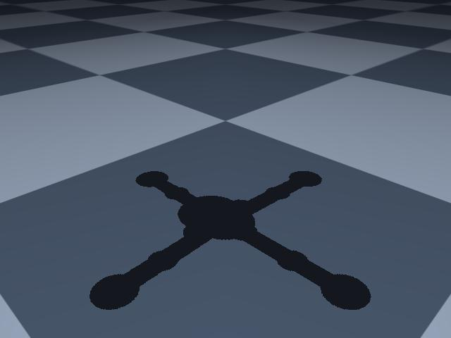

# Defining a Ground Surface

!!! abstract

    The rocket needs some ground to collide with, we will be defining a custom class which will contain the key elements needed to configure the ground.

    <figure markdown="span">
        { width="50%" height="auto" }
        <figcaption>A horizontal plane acting as the ground. The ground has a checkerboard pattern and a shadow of the rocket tube (yet to be defined) cast from the light added in the previous step.</figcaption>
    </figure>

---

## Class Definition

The `Ground` class is (thankfully) pretty straightforward. We define three things:

1. **Grid Texture**: A checkerboard texture used on the ground plane. It is technically not needed, but helpful to give things a sense of scale.
2. **Material**: To apply a texture to a geometry (like our ground plane) we apply it via a material. This gives options for other photorealistic rendering textures, but we will stick with the simple built-in one for now.
3. **Geometry**: A `GeomPlane` (a special built-in geometry type) is used to make a contact surface for the rocket. It can be positioned in whatever orientation is needed.
    - For a more complex model, you could even use a heightmap to simulate an uneven surface!

```python
--8<-- "docs/user-guides/examples/vlr/vlr_example.py:ground"
```

---

!!! success

    We have defined a ground plane, its contact behavior, and applied it to our `mojo_model`! We are now ready to begin building the rocket and landing gear assembly.
