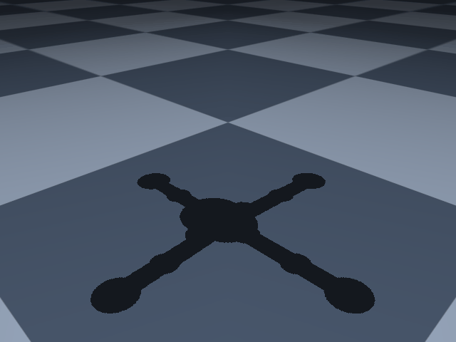

# Vertically Landing Rocket

!!! abstract

    This guide will walk you through the complete definition of a model using MuJoCo. In the example, we will build a model of a set of landing gear for a vertically landing model rocket. This model's construction follows a more object oriented approach than the previous example. The purpose of the model is to assess the set of inputs used to design the rocket's landing gear.

    <figure markdown="span">
        { width="50%" height="auto" }
        <figcaption>The visual result of the completed model: the rocket has four landing gear equally spaced around its radius. A spring-damper is located on each leg to absorb the impact.</figcaption>
    </figure>

    This example is based on work I performed in the writing of [this paper](https://www.ideals.illinois.edu/items/128732).

The model we will build will be composed of Python classes specific to this application, and will use Mojo to help us build the MuJoCo MJCF files and run simulations. Optionally the Mojo [optimization plugin](../../features/optimization.md) can be used to run a parameter design study to tune to custom initial conditions.

I recommend you build this model line by line with me, limiting direct copying of code. I also highly recommend using [Mojo's Reloaded tool](../../features/reloaded.md) to see live progress while you modify your code.

---

## Project Initialization

To begin, make a new project directory and run the following code to have Mojo build scaffolding for you:

```bash linenums="0"
mujoco-mojo init
```

This will initialize your project with a mock Python file, some helpful bash scripts to make running Mojo easier, and a settings file so you can customize your project settings (see `mujoco-mojo settings --help` for more options).

---

## Imports

Some key things will be used in this project, notably a logger, a global unit system (for easier conversions, MuJoCo tends to only play nice with SI units from my experience), and a set of contact groups (dont worry about these too much for now but these are important later).

```python
--8<-- "docs/user-guides/vlr-example/vlr_example.py:imports"
```

---

## Inputs

This project will also make use of an `Inputs` class. This class is used to set some static values which we will be using all over the place. It is convenient to build a class like this since it can hold key values, and allow for easy modification when tinkering with the model later on.

This is also the first place where you see the use of our unit system (`US`). Since our unit system is defined as SI units, you can declare a value with any unit (a length of 3 inches is declared as `3 * US.inch`) and `US` will automatically convert the value into a dimensional equivalent in SI units.

```python
--8<-- "docs/user-guides/vlr-example/vlr_example.py:imports"
```

---

!!! success

    Thats enough of an introduction, everything we have done thus far is just setting ourselves up for success. In the next guide, you will see how to get Mojo started with generating the kinematic tree.
