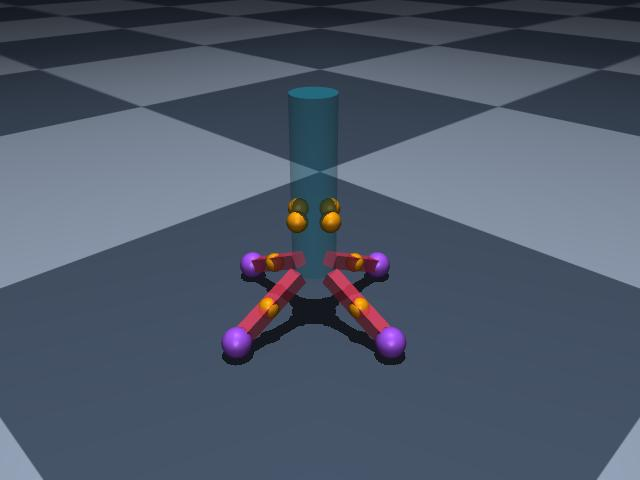

# Building the Rocket

!!! abstract

    This section walks through the first step in building our kinematically unconstrained (free falling) rocket body. It will setup the body on which we will be connecting a set of identical landing gear.

    <figure markdown="span">
        { width="50%" height="auto" }
        <figcaption>The completed rocket landed on the ground. The rocket has a transparent blue cylinder representing the body tube and four identical red legs (defined later) with purple footpads. The yellow spheres on the tube and midway on the legs represent where the shock absorbers will be connected.</figcaption>
    </figure>

---

## Making the Body

The rocket is composed of a `body` and a set of `landing_gear` and is created with the `Rocket.new()` class method to keep form with the other constructors.

1. `mojo.BodyName`: A simple name to render in the viewer.
2. `mojo.GeomCylinder`: The body tube geometry defined with a radius and length
   - Its mass is declared to something reasonable.
3. `mojo.PoseEuler`: This type sets the initial position and orientation (when combined this is called a pose).
    - We also define a slight initial tip off angle of a few degrees.
    - There are many other ways to define an orientation such as quaternions, axis angles, etc.
4. `mojo.FreeJoint()`: This allows the body to move freely. Without this it would just be stuck in place.
    - _Try commenting this line out to see for yourself!_ You will see the body just levitates.
5. Finally, the body is appended to the list of `worldbody` bodies.

```python
--8<-- "docs/user-guides/examples/vlr/vlr_example.py:rocket"
```

---

!!! success

    We have defined the main free kinematic body we are studying. After defining the main body, we enter a for loop to define each side of the landing gear system. We will cover the building the landing gear next.
