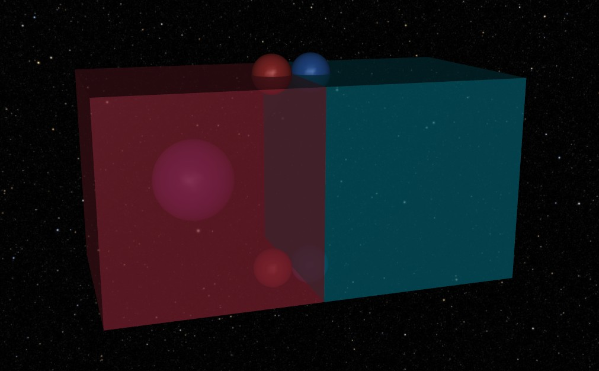

# Generate Script

!!! abstract
    The **Generate Script** is the heartbeat of your simulation pipeline. Its job is to programmatically assemble the MuJoCo MJCF model and perform all stochastic (random) draws. By the time this function returns, the simulation should be "frozen" in its initial state, ready for the physics engine to take over.

    <figure markdown="span">
        { width="50%" height="auto" }
        <figcaption>The visual result of the completed generator script: two translucent boxes with freejoints, spring attachment sites (red and blue spheres), and a central tracking site (fuchsia sphere), all set against a starry skybox.</figcaption>
    </figure>

!!! info "Suggested Reading: Mojo Reloaded"
    After a brief skim of this guide, you may want to take a look at [the guide](reloaded.md) on using **Mojo Reloaded** to accelerate your prototyping.

---

## The Generate Function Contract

The generate script is built around the "MojoGenerate" protocol. This function provides a bare bones `mojo.MojoModel` which **must** be its first argument and optional `*args` and `**kwargs`.

It also **must** return a `mojo.MojoModel`.

???+ example "Example: MojoGenerate Handle"
    ```python
    --8<-- "docs/user-guides/monte_carlo_example.py:generate-handle"
    ```

---

## The Handoff Pattern

Because Mojo separates **Generation** (building the model) from **Runtime** (running the physics), you often need to pass references between them. Sites, bodies, or specific random values sampled during generation are often needed later to apply forces.

We use a `Handoff` dataclass or Pydantic BaseModel to encapsulate these references. This keeps your generate function clean and your runtime logic strongly typed.

???+ warning "Warning: User Data Validation"
    Using a non-Pydantic BaseModel based `Handoff` will not be validated. If it is critical to have a validated Handoff you should use a BaseModel.

    Handoff objects are also not serialized when running, so it is not recommended to rely on this for future recreation of models.

??? example "Example: Handoff Class"
    ```python
    --8<-- "docs/user-guides/monte_carlo_example.py:handoff"
    ```

---

## Assets and Materials

Assets like textures and materials are defined in the `mojo_model.mjcf.assets` list. This is where you handle external files (like skyboxes) or built-in procedural textures like checkerboards.

Notice in the following code how enumerations such as `mojo.TextureType.D2` and `mojo.TextureBuiltInType.CHECKER` are used instead of strings.

???+ tip "Tip: Walrus Operator (`:=`)"
    Notice the use of the walrus operator, this allows you to define an object and immediately keep a reference to it for later use in the script.

    We will be using the `grid_mat` Material in the next section!

???+ tip "Tip: Color Utilities"
    Mojo provides some helpful utilities like `mojo.utils.Color`. This class provides a ton of helpful shortcuts for [Tailwind CSS](https://tailwindcss.com/docs/colors) colors. This makes it really easy to customize the appearance of your model.

???+ example "Example: Assets Definition"
    ```python
    --8<-- "docs/user-guides/monte_carlo_example.py:assets"
    ```

Mojo uses `DepPath` to handle asset paths, ensuring that your models remain portable across different machines. They have identical properties to `pathlib.Path`. In the `MojoModel.mjcf`, wherever you would use a `Path` object, instead use a `DepPath`.

Using `DepPath` is the key to portability; it tells Mojo to track the file as a dependency that is integral to your model. This allows Mojo to share a file on disk between different runs, preventing extra bloat!

---

## Building the Worldbody

The `worldbody` contains your static environment and the kinematic tree of your bodies. Mojo's API mirrors the XML hierarchy exactly.

???+ note "Note: Pose"
    Mojo provides many ways to define a position and orientation ([pose](https://en.wikipedia.org/wiki/Pose_(computer_vision))). Shown below is a pose definition using `mojo.PoseQuat`. Other orientation options are using an axis angle, Euler angle sequence, X and Y axes, or a Z axis.

???+ example "Example: Worldbody Definition"
    ```python
    --8<-- "docs/user-guides/monte_carlo_example.py:worldbody"
    ```

---

## Sampling Distributions

Instead of using `random.uniform()`, use `mojo_model.sample_dist()`. This ensures that every random draw is:

- **Reproducible** (tied to the job's [seed, distribution name, and trial number](https://hydrowelder.github.io/stochas/reference/stochas/distribution/#stochas.distribution.Distribution.seed)).
- **Recorded** (stored in the results database as a `NamedValue`).
- **Overridable** (can be forced to a specific value via the CLI).

???+ note "Note: Squeezing `NamedValues`"
    The `mojo_model.sample_dist` method returns a `NamedValue` which works like a numpy array. You can use the `.sqeeze()` method to compact it (i.e., `[1.0].squeeze() == 1.0`)

???+ example "Example: Sampling"
    ```python
    --8<-- "docs/user-guides/monte_carlo_example.py:sampling"
    ```

## Finalizing the Model

Lets tie things up! At the end of your `generate` function, you attach your `Handoff` data to the `mojo_model.user_data` attribute. This makes it accessible to the `runtime` function later.

???+ example "Example: End of Function"
    ```python
    --8<-- "docs/user-guides/monte_carlo_example.py:generate-finalizing"
    ```

???+ note "Note: User Data Validation"

    User data is also required to be serializable! It should be a Pydantic `BaseModel`. If there is something you really are not able to make serializable, you can always use a [`PrivateAttr`](https://pydantic.dev/docs/validation/latest/concepts/models/#private-model-attributes) but this should be considered a last resort.

    All of the Mojo MJCF objects are serializable. For some Numpy helpers, try using `mojo.VecN`!

---

!!! success
    *Okay. That was kind of a lot.*

    Now that we have completed building the kinematic tree, defining a user data to handoff, and an introduction to using distribution sampling, we now move on to defining the [runtime behavior](runtime-script.md) of the physics engine.

??? example "Example: Full Generate Script"
    ```python
    --8<-- "docs/user-guides/monte_carlo_example.py:generate"
    ```
